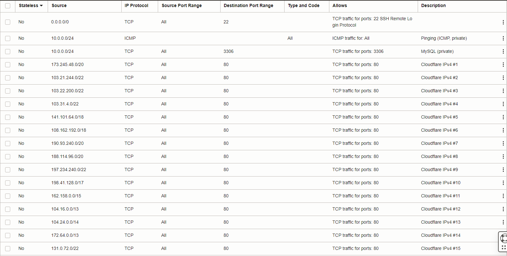

## Strict setup script for Oracle's VCN submask security rules
1. Login to Oracle dashboard and open go to:
`Networking >> Virtual cloud networks >> vcn-20220325-1625 >> Security List Details`
2. Allow for SSH connections from any source (TCP 22, 0.0.0.0/0),
3. Add ICMP pinging from local, private ips (same vcn) (ICMP [ALL] 10.0.0.0/24)
4. Also allow for MySQL TCP connections between machines in same vcn (TCP 3306, 10.0.0.0/24)
5. Expose TCP 80 port (nginx website and reverse proxies) **only** for cloudflare ips (v4). Check https://www.cloudflare.com/ips-v4 for list of ips in use.

To be sure, check `firewall-example.png` image:
